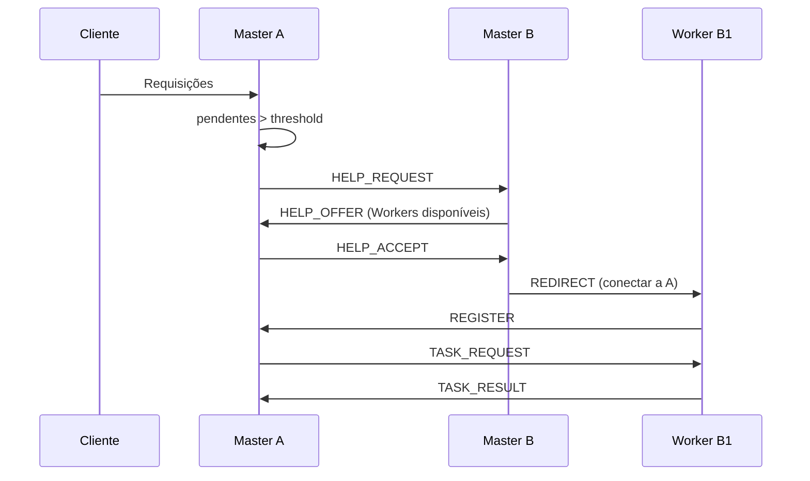

# Arquitetura P2P com Balanceamento de Carga Dinâmico

## Visão geral

Sistema distribuído autônomo com balanceamento de carga horizontal em arquitetura P2P:

- **Master**: gerencia uma Farm (conjunto de Workers), recebe requisições, distribui tarefas, monitora carga e inicia o protocolo consensual quando saturado.
- **Worker**: executa tarefas do Master atual; pode ser redirecionado temporariamente para outro Master.
- **Protocolo**: mensageria JSON (REST e/ou TCP com `\n`) garante interoperabilidade entre equipes.

## Papel das entidades

### Master

- Mantém lista de Workers (próprios e emprestados).
- Recebe requisições (simuladas) e distribui entre Workers (round-robin ou fila).
- Monitora requisições pendentes; se `pendentes > threshold`, inicia o Protocolo de Conversa Consensual.
- Gerencia Workers emprestados: aceita registro, atribui tarefas, pode devolver quando a carga normalizar.

### Worker

- Registra-se em um Master e envia HEARTBEAT periódico.
- Recebe TASK_REQUEST, executa (cálculo, sleep) e envia TASK_RESULT.
- Obedece ao comando REDIRECT: desconecta do Master atual e conecta ao novo Master.

### Farm, threshold e saturação

- **Farm**: conjunto de Workers sob um Master (próprios + emprestados).
- **Threshold**: limite configurável de requisições pendentes.
- **Saturação**: quando requisições pendentes excedem o threshold; o Master solicita ajuda aos vizinhos.

## Diagrama de sequência (resumo)

Ver diagramas detalhados em [DIAGRAMA_SEQUENCIA.md](DIAGRAMA_SEQUENCIA.md): requisições e distribuição entre workers, saturação Master ↔ Master e devolução de workers.

## Uso de FastAPI e sockets

- **FastAPI (REST)**: endpoints para clientes (envio de tarefas), registro de Workers, heartbeat, protocolo Master–Master (HELP_REQUEST, HELP_OFFER, HELP_ACCEPT), métricas e simulador de carga.
- **TCP/WebSocket (opcional)**: se for usado canal stream para Worker–Master (heartbeat/tarefas), aplicar Message Delimiter `\n` e leitura por linha no receptor; FastAPI continua como interface principal para clientes e Master–Master.
