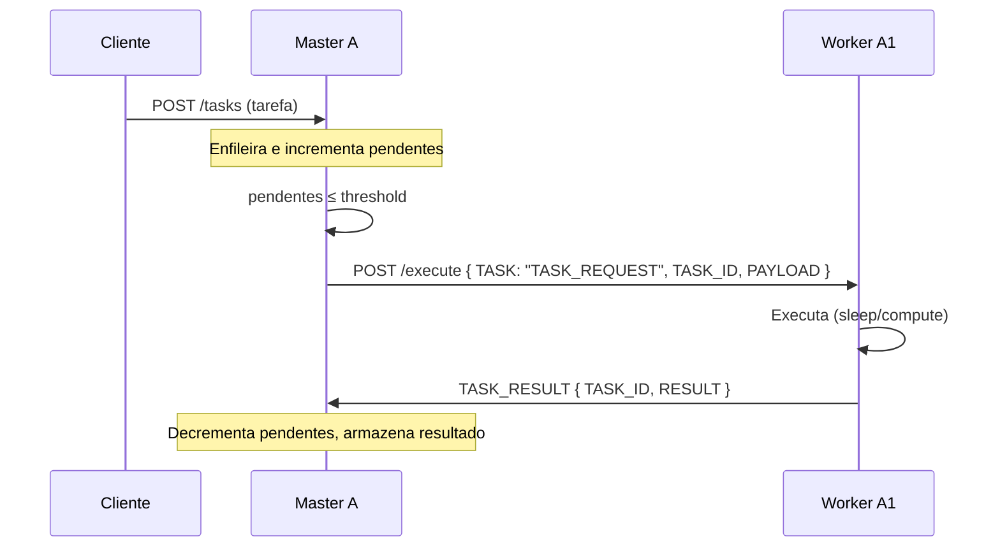
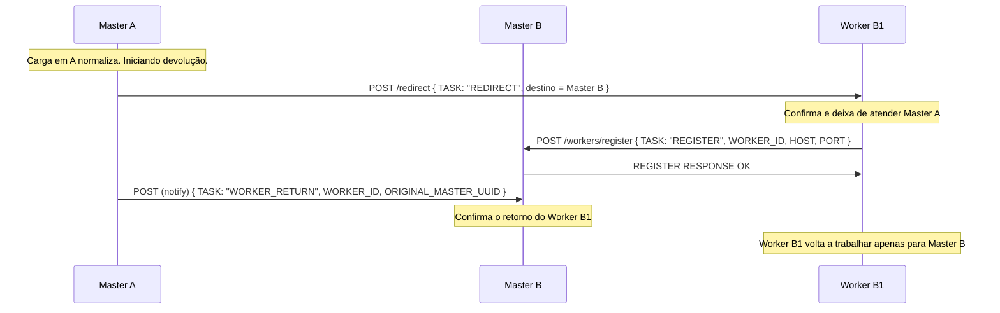

# Diagramas de Sequência – Requisições e Distribuição entre Workers

Este documento descreve o fluxo de requisições, a distribuição de tarefas entre workers e a comunicação Master–Master em caso de saturação, alinhado ao plano do projeto e à implementação atual.

---

## 1. Requisições e distribuição normal (Cliente → Master → Worker)

O Cliente envia tarefas ao Master via `POST /tasks`. O Master mantém uma fila e um contador de pendentes; o loop de distribuição (round-robin) envia `TASK_REQUEST` aos workers registrados e aguarda `TASK_RESULT`.



---

## 2. Comunicação Master ↔ Master (Saturação)

Quando o número de requisições pendentes excede o threshold, o Master A inicia o protocolo de conversa consensual: envia `HELP_REQUEST` aos Masters vizinhos, recebe `HELP_OFFER`, escolhe a melhor oferta e envia `HELP_ACCEPT`. O Master que cede envia `REDIRECT` aos Workers; o Worker redirecionado registra-se no Master A e passa a receber `TASK_REQUEST` dele.

```mermaid
sequenceDiagram
  participant MA as Master A
  participant MB as Master B
  participant WB as Worker B1

  Note over MA: Master A detecta saturação (pendentes > threshold)
  MA->>MB: POST /help/request { TASK: "HELP_REQUEST", PENDING_COUNT, THRESHOLD }

  alt [Master B tem capacidade ociosa]
    MB->>MA: HELP_OFFER { AVAILABLE_WORKERS, OFFER_COUNT, WORKER_IDS }
    MA->>MB: POST /help/accept { TASK: "HELP_ACCEPT", REQUESTER_HOST, REQUESTER_PORT, WORKER_IDS }
    MB->>WB: POST /redirect { TASK: "REDIRECT", TARGET_MASTER_HOST, TARGET_MASTER_PORT }
    Note over WB: Atualiza master e re-registra no novo Master
    WB->>MA: POST /workers/register { TASK: "REGISTER", WORKER_ID, HOST, PORT }
    MA->>WB: REGISTER RESPONSE OK
    Note over WB: Worker B1 agora trabalha para Master A
    MA->>WB: POST /execute { TASK: "TASK_REQUEST", TASK_ID, PAYLOAD }
    WB->>MA: TASK_RESULT { TASK_ID, RESULT }
  else [Master B está ocupado / sem workers para ceder]
    MB->>MA: HELP_OFFER { OFFER_COUNT: 0 }
    Note over MA: Conexão encerrada; tenta outro vizinho ou desiste
  end
```

---

## 3. Normalização da carga e devolução do Worker

Quando a carga no Master A normaliza, o Master A pode devolver o Worker emprestado: envia comando de liberação ao Worker (REDIRECT de volta ao Master original) e notifica o Master B com `WORKER_RETURN`. O Worker reestabelece conexão com o Master B e re-envia REGISTER.



---

## Resumo dos tipos de mensagem (TASK)

| TASK           | Direção        | Uso no diagrama                                      |
|----------------|----------------|------------------------------------------------------|
| HELP_REQUEST   | Master → Master| Pedido de ajuda ao detectar saturação                |
| HELP_OFFER     | Master → Master| Resposta com workers disponíveis (ou oferta vazia)   |
| HELP_ACCEPT    | Master → Master| Aceite da oferta e lista de WORKER_IDS               |
| REDIRECT       | Master → Worker| Ordem para se reportar a outro Master                |
| REGISTER       | Worker → Master| Registro (ou re-registro) na Farm do Master          |
| TASK_REQUEST   | Master → Worker| Atribuição de tarefa (POST /execute)                 |
| TASK_RESULT    | Worker → Master| Resultado da execução                                |
| WORKER_RETURN  | Master → Master| Notificação de devolução do Worker ao Master original|

A comunicação é realizada via **HTTP (REST)** com payloads JSON; os endpoints utilizados estão descritos em `PROTOCOLO.md` e `ARQUITETURA.md`.
